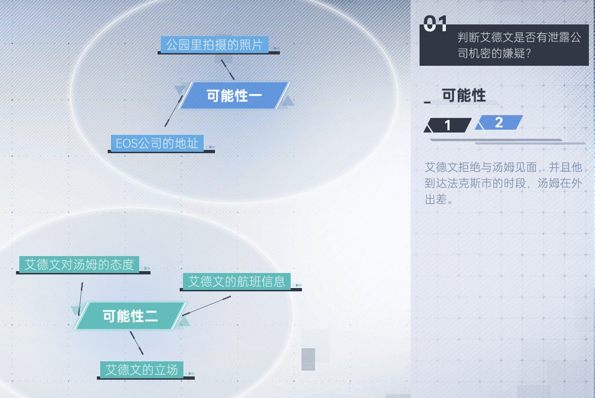

# 序章 - 小试身手

1. 打开邮箱，获得目标名字【艾德文·赫伯】

2. 浏览器搜索【艾德文·赫伯】，点击Toothbook，收集

* （1）Edwin_H

* （2）TB3107121

* （3）今天股市的行情不错。#每日股市#

* （4）1959年12月10日，到现在刚好是61年。

3. 打开数据库，输入【艾德文】相关信息并收集破解密码【Ed432hob】

4. 登录【艾德文】的Hitalk账号，收集

* （1）莱特：泰坦股票肯定会不断涨，我已经在上面投入一小笔钱了

* （2）汤姆：不用了，我有很多别的事情要忙

* （3）汤姆：汤姆的名片图片

5. 打开【汤姆的名片】，收集

* （1）汤姆·布兰科

* （2）EOS公司的地址

6. 浏览器搜索【汤姆】，点击Toothbook，收集【新的项目终于看到了希望】

7. 入侵【艾德文】的手机，入侵后，查看相册，收集【公园.jpg】；根据相册提示【12369874.jpg】，解锁短信图案，收集

* （1）阿特拉斯航空：航班抵达法克斯市

* （2）布兰科太太：他离开法克斯市正合我意，我不想因为和他见面而惹上麻烦

## 推理：

9. 完成推理后，点击【提交】

