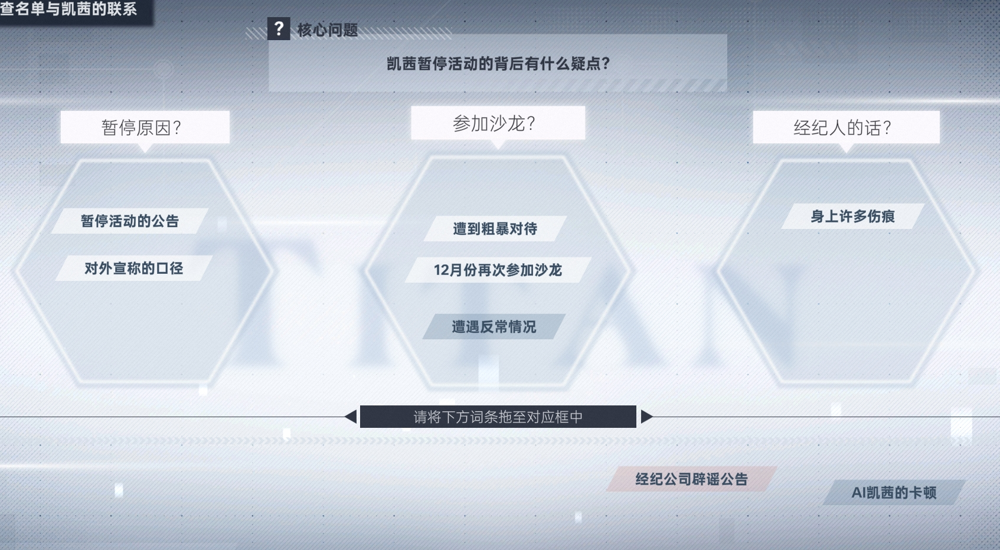
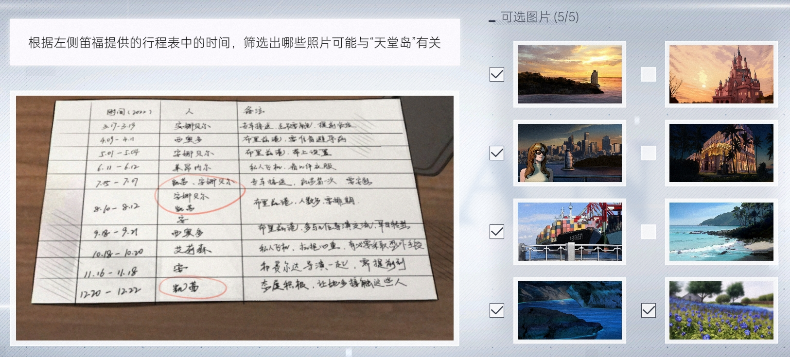
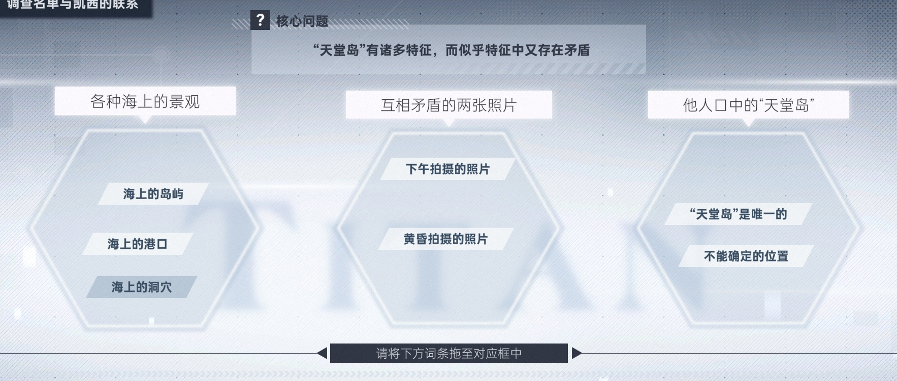
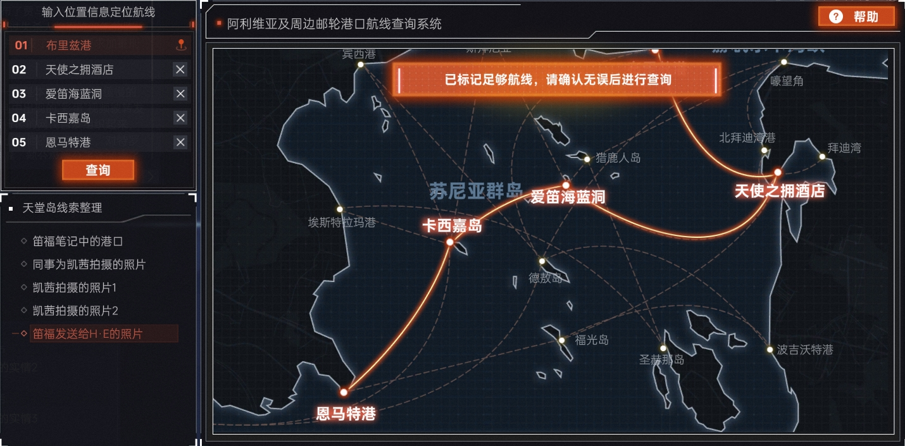
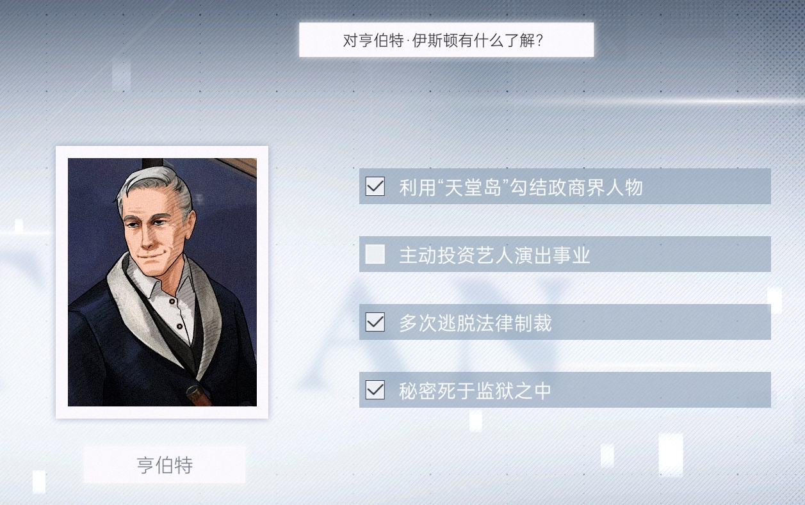
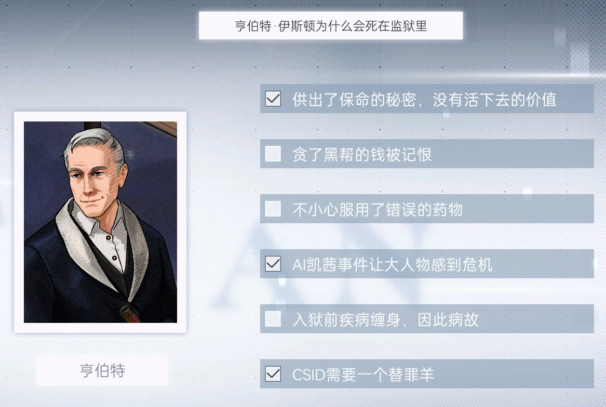
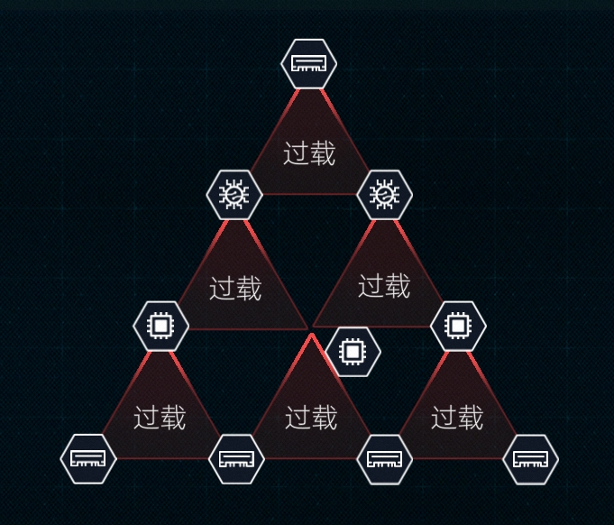

# 第四章：轮盘、餐盘与棋盘

1. 从邮箱点击网址，在【许愿池】收集【好好的一个姑娘被泰坦改造成了AI】

2. 打开浏览器搜索【天堂岛】，点击【CPA公司回应凯茜与“天堂岛名单”传闻】，收集
* （1）凯茜·华顿
* （2）凯茜与天堂岛的传闻属不实信息

3. 点击【我推的孩子，在天堂岛名单上？！】，收集【她一定充岛上拿到了很多资源吧】

4. 浏览器搜索【凯茜·华顿】，点击【直播事故！数字生命主播翻车？】，收集
* （1）主播CαThγ直播间突发诡异故障
* （2）世界首个数字生命主播
* （3）CαThγ不仅没有做出解释，反而出现了异常的卡顿！

5. 点击【凯茜】的Toothbook，收集
* （1）CαThγ
* （2）TB5640997
* （3）感谢泰坦的技术赋予我第二次生命
* （4）凯茜个人出行时遭到车祸
* （5）天使手雕图片

6. 点击【凯茜】的Witapedia，收集
* （1）2008.03.12
* （2）创艺先驱经纪公司
* （3）知名导演里尔·梅耶还承诺为其量身定做一部影片

7. 点击【孩子成功背后都有一位“严格”母亲】，收集【严厉就是爱的一种形式】

8. 点击【电影好评如潮，备受瞩目的小影星诞生】，收集【小小年纪就有如此出色的表现】

9. 浏览器搜索【数字生命】，点击【用AI技术复现亲人朋友，是慰藉还是谎言？】，收集
* （1）们造出工具不是为了让它亵渎上帝
* （2）邪恶的巫师用糖果诱惑孩子们走进森林，把孩子们做成蛋糕，最后端上了魔鬼的餐桌

10. 浏览器搜索【创艺先驱经纪公司】，点击【数字生命凯茜重新出道，反响热烈，经纪公司如何看待？】，收集
* （1）默里·笛福
* （2）笛福先生不仅是凯茜的经纪人，他还有个身份就是凯茜的继父

11. 点击【阿利维亚最强的经纪公司是哪家？】，收集【CPA公司更是其中的佼佼者，大半个导演圈都和他们有过合作】

12. 打开数据库，输入【凯茜】相关信息收集并破解密码【CatW2008】

13. 登录【凯茜】的Hitalk，收集
* （1）笛福：351-7230-284
* （2）笛福：你现在是最年轻的奥卡斯最佳女演员获奖者
* （3）笛福：有个影视圈的海上沙龙，会有很多影视界的前辈们到场
* （4）笛福：就让我和安娜贝尔表演一些很奇怪的动作
* （5）笛福：我被连拉带拽地拖到了顶层房间
* （6）笛福：我能再去一次吗？
* （7）安娜贝尔：我还是想提醒你，不要相信笛福
* （8）吉娅：你要记住你们是竞争关系，不要和她走得太近
* （9）吉娅：我真的很希望能有一个玩伴

14. 浏览器搜索【默里·笛福】，点击【丑闻频出，知名经纪公司旗下明星被曝靠潜规则上位！】，收集【早有传闻费尔达导演对于男演员有特殊癖好】

15. 点击【笛福】的Toothbook，收集
* （1）CPA-Defoe
* （2）TB45813870
* （3）关于AI凯茜的归属权问题，CPA公司和泰坦公司并不存在法律上的争议
* （4）父女照片
* （5）恭喜安娜贝尔获得奥卡斯金胶片奖提名

16. 浏览器搜索【安娜贝尔·约瑟芬】，点击【好像看到个明星】，收集【这难道就是凯茜去天堂岛的第一现场视角】

17. 打开数据库，输入【笛福】相关信息收集并破解密码【09780901】

18. 登录【笛福】的Hitalk，收集
* （1）摩根：自从之前那位歌星隐退之后，你们公司就毫无起色
* （2）摩根：虚拟明星还挺有噱头，泰坦给我们做了一波很好的营销
* （3）珍妮：珍妮语音1
* （4）珍妮：珍妮语音2
* （5）珍妮：珍妮语音3
* （6）吉娅：CathyW@uu.ccm
* （7）吉娅：我已经和医院反复交代了，必须要最好的治疗方案
* （8）吉娅：要是成为了AI，还能留住你心中最美好的她
* （9）H.E：你在金色天堂似乎赌运不佳
* （10）H.E：我在天堂岛上要办一场私人宴会，里面的客人对你手里的一些艺人很感兴趣
* （11）H.E：配得上这个名字的地方只有一处
* （12）H.E：下个月有位重要的客人出席宴会，我想让他们多交流交流
* （13）H.E：凯茜停止活动是因为个人出行时遭遇了车祸

19. 登录【笛福】的邮箱，收集
* （1）收件箱-A-Mobile：531-9837-653
* （2）收件箱-A-Mobile：103-1013-013
* （3）收件箱-H.E：艺人服务协议图片
* （4）收件箱-金色天堂：新域名链接

20. 登录【凯茜】的邮箱，收集
* （1）收件箱-Olivia Knight：你这样的东西就应该被销毁
* （2）收件箱-笛福：参加海上沙龙

21. 打开匿名电话，打给【A-Mobile客服中心】，选择【20130318】

22. 在匿名电话，完成声纹合成后，打给【笛福】套话，收集（成就：让我戳一下）
* （1）我看到她的时候，她身上有很多伤痕
* （2）我猜那只是个代号，但具体的位置我真的不知道
* （3）他势力很强，在各个领域都有资源

23. 打开邮箱，收集【凯茜天堂岛行程图片】

24. 点击【凯茜天堂岛行程】图片，扫描收集【布里兹港】

## 第一次推理

* （2）天堂岛

* （5）船只

26. 完成路线整理后，收集【亨伯特·伊斯顿】

27. 浏览器搜索【伊斯顿】，点击Witapedia，收集
* （1）历任总统候选人、现任阿利维亚证监会长以及劳工部部长等都有与其交往密切
* （2）创立阿利维亚失踪和被剥削儿童中心

28. 点击【低调富豪“H·E”默默捐助，点亮孤儿们的希望之路】，收集【H·E】

29. 点击【天堂度假村工地悲剧：伊斯顿投资项目突发严重事故】，收集【初步调查指向施工过程中可能存在的偷工减料行为】

30. 点击【慈善家伊斯顿的真实面孔】，收集【比利弗山庄1号】

31. 打开数据库，输入【伊斯顿】相关信息收集并破解密码【HEparadc】

32. 登录【伊斯顿】的Hitalk，收集
* （1）德威特：我们的赔率是可以操控的
* （2）德威特：把我现在全部的可流动资产都转到端仕那边的信托基金
* （3）德威特：抓紧联系拜迪那边准备好合适的落脚点
* （4）德威特：记得把船上重要的东西备份，剩下的证据都处理掉
* （5）埃尔维拉：事情解决之后陪你去医院做心脏复查
* （6）€：当我发火的时候，整个世界都会知道这件事闹得有多大
* （7）€：你最好对自己的靠山尊重一点
* （8）€：天堂岛名单的事情，那不是我散播的
* （9）€：你最好重新考虑你的立场，决定是要成为团队的一分子，还是成为被历史遗忘的牺牲品
* （10）艾德文：这并不是拥有生前记忆的人工生命
* （11）洛伦特：为了那些秘密，他们会保护我的

33. 登录【伊斯顿】的邮箱，收集
* （1）收件箱-霍华德：CSID申请了逮捕令，下午行动
* （2）发件箱-Haly：我希望你能多带些朋友来，你懂吗？
* （3）发件箱-Dinah：就连大法官都不敢这样威胁我，我是不可能被抓的

34. 浏览器搜索【CSID】，点击【CSID突袭豪宅行动疑涉天堂岛名单？】，收集【警方给出的答复却是正在调查一起网络金融犯罪案件】

35. 入侵网络安全调查部，获得密码【985344134】

36. 根据Van给的地址，输入账号密码登录，点击卷宗档案查询，输入【亨伯特·伊斯顿】【2023.03.24】【金融犯罪】，收集
* （1）第一页：多次组织非法性交易
* （2）第一页：提供政治献金、干涉奥利维亚司法公正，操纵国家大选
* （3）第一页：涉嫌故意伤害阿利维亚公民凯茜
* （4）第一页：奥格斯·威尔
* （5）第二页：最终抢救无效，与当日7时14分不幸逝世（成就：弃子）

37. 根据【威尔】警员档案和【今日访谈】推理得知第三页密码【20140505】，收集
* （1）脸、不要打脸
* （2）我认！都是我干的
* （3）金色天堂、......我的账号、清空......奖池。HoleCards，这是密码

38. 浏览器进入金色天堂网页，登录后，完成金蒂扑克，收集（成就：天堂之门、饕餮之徒）
* （1）L3顶层甲板-船长室-宾客记录：12月21日登船名单.xls（退出自动收集）
* （2）L3顶层甲板-船长室-宾客记录-船长助理指令记录：快到布里兹港了，把那位大人物送到高蒂市中心医院去
* （3）L3顶层甲板-梅花房-录音内容-audio_1221_club_2.wav：这话你应该在3天前说，我的派对都结束了
* （4）L3顶层甲板-梅花房-录音内容-audio_1221_club_3.wav：一个小屁孩带着相机跑到顶层都没人发现
* （5）L3顶层甲板-梅花房-录音内容-audio_1221_club_3.wav：操，敢拿刀捅我
* （6）L3顶层甲板-梅花房-录音内容-audio_1221_club_4.wav：被台灯砸了很多下，脑部受创
* （7）L2娱乐甲板-休息区-拍摄内容：IMG_1221_lounge_2.jpg
* （8）L1娱乐甲板-左通道-拍摄内容：IMG_1221_corridorL_1.jpg

## 第二次推理

* （3）罗斯·英格索尔

40. 浏览器搜索【罗斯】，点击Toothbook，收集【看她僵硬的动作和语气，一眼就能看出是提前录制好的假视频】

41. 根据【Witapedia】和【audio_1221_club_2.wav】得知【罗斯】出生日期【1957.12.18】，在医院数据库填入【罗斯】信息，收集
* （1）罗斯报告1
* （2）罗斯报告2

42. 扫描【罗斯报告1】，收集
* （1）17
* （2）639-3726-463
* （3）伤口并不严重

43. 扫描【罗斯报告2】，收集
* （1）Dsc
* （2）1957.12.18
* （3）AG10219571218273
* （4）患有阿尔茨海默症
* （5）Ingersoll@uu.ccm

44. 在破解填入【罗斯】信息，收集【Rose_so1】

45. 登录【罗斯】的邮箱，收集
* （1）收件箱-竞选经理-贝内特：这次租用了银河广场的场地和巨大屏幕
* （2）收件箱-卫生部-玛卡尔：那个女孩下船后被转移到了拉刻西斯医院
* （3）收件箱-司机-卡迪：吉娅·华顿
* （4）收件箱-司机-卡迪：1988.08.18
* （5）收件箱-司机-卡迪：93
* （6）收件箱-司机-卡迪：372-1002-728
* （7）收件箱-司机-卡迪：这是上个月进步党那边的窃听录音，有些东西需要您听一下
* （8）收件箱-司机-卡迪：下周边境的恐怖组织会自发地对泰坦的芯片原料工厂进行破坏
* （9）收件箱-司机-卡迪：罢工的事已经安排人去做了
* （10）发件箱-司机-卡迪：至于那个凯茜的事情，伊斯顿已经认罪了
* （11）发件箱-竞选经理-贝内特：明天的竞选集会演讲至关重要
* （12）发件箱-竞选经理-贝内特：现在需要的不仅仅是一场集会，而是一个震撼全国、展示我们强大党派力量的标志性事件
* （13）发件箱-卫生部-玛卡尔：凯茜有大概率苏醒，但泰坦的人要推广AI凯茜那个假货，所以才不让凯茜痊愈

46. 浏览器搜索【拉刻西斯医院】，点击【震惊！拉刻西斯医院背后的秘密！】，收集【这家医院是否在暗中协助泰坦进行人体实验？】

47. 打开医院数据库填入【凯茜】信息，收集
* （1）凯茜报告1
* （2）凯茜报告2

48. 扫描【凯茜报告1】，收集
* （1）Rh阴性血
* （2）术后有大概率可苏醒

49. 扫描【凯茜报告2】，收集【同意凯茜的手术治疗】

50. 打开浏览器搜索【吉娅】，点击Toothbook，收集
* （1）4MyLovelyCathy
* （2）TB1420354
* （3）今天是凯茜的生日，不论是以什么样的形式活下来，我都希望她能够过得快乐
* （4）看到座无虚席的会场，才意识到原来凯茜真的长大了

51. 打开数据库，输入【吉娅】相关信息收集并破解密码【cathy312】

52. 登录【吉娅】的Hitalk，收集
* （1）库珀：及时签署了同意书，不然这个女孩就要彻底成为植物人了
* （2）库珀：有苏醒迹象
* （3）妈妈：可我认为凯茜得学会解决问题，我一直是这么教她的
* （4）妈妈：四张纸图片
* （5）笛福：我们互不干涉对方的生活
* （6）为了凯茜：如果没有凯茜留下来的名单......我也没办法那么轻易地找到你们
* （7）为了凯茜：我亲自去拜访（成就：为你，千千万万）

53. 点击提交

## 神罚

1. 矩阵密码：9870

2. 

3. 自我认知：凯茜·华顿-揭露真相-自由意志

4. 策略规矩：唯一真相-凯茜·华顿

5. 目标任务：揭露真相-曝光罗斯-揭发帮凶

6. 完成劫持卫星（成就：卫星劫客）

