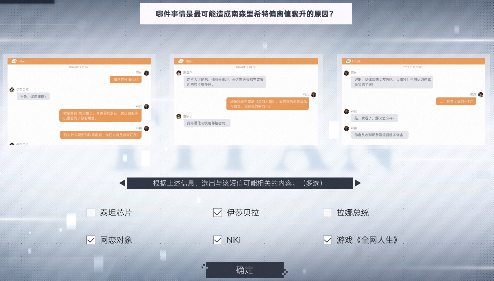

# 第五章：当命运齿轮转动

1. 从邮箱收集
* （1）南森·里希特
* （2）AG10919960217209
* （3）TBM-127-IR6382

2. 浏览器搜索【南森·里希特】，点击Toothbook，收集
* （1）N.R
* （2）TB9800265
* （3）奉劝想接种芯片的各位想清楚，泰坦的协议上面可没告诉我们怎么摘除它
* （4）徒步照片
* （5）接种完芯片生活真是便利了不少。特别是用上了Atro之后，感觉自己无所不能！
* （6）全网人生

3. 点击【泰坦芯片是微型炸弹？总统亲自辟谣！】，收集【克里夫总统发布公开声明，将会在高蒂市中心广场当众接种芯片，以示芯片安全性】

4. 点击【陪伴型AI大受欢迎？“人机恋”引发社会争议！】，收集【Atropos】

5. 浏览器搜索【全网人生】，点击【《全网人生》：年轻人的第一款模拟生活类游戏】，收集【这款游戏最值得关注的地方就是它的社交系统，你可以带着你创造的角色与社区内其他人的角色产生交集，并且自由选择你想要的关系发展】

6. 浏览器搜索【Atropos】，点击【泰坦公司推出Atropos人生管家：智能生活的新篇章】，收集【对话功能搭载了泰坦最新Talk-GPT，让用户随时拥有一个贴心的小助手】

7. 打开数据库，输入【南森】相关信息收集并破解密码【nRiCht3r】

8. 登录【南森】的Hitalk，收集
* （1）塞缪尔：我觉得接种过芯片之后反而变得健忘了
* （2）Jeremy：不瞒你说，能追到莉丝，也多亏泰坦那个Atro给我的建议
* （3）Jeremy：Jeremy，你还记得Niki这个ID吗？
* （4）莉丝：但你有没有想过，如果我们的相遇是被刻意安排的呢？
* （5）莉丝：契合度报告图片
* （6）莉丝：你自从收到那条短信就魂不守舍！
* （7）莉丝：不安全，芯片背后有阴谋
* （8）爸爸：爸爸，一定不要去接种芯片！
* （9）Bryan：我听说Atro背后是真人在操纵呢，性格才会这么灵动
* （10）Bryan：接种过芯片之后你有没有觉得忘记了什么事？
* （11）Bryan：你怎么突然辞职了？

9. 点击【契合度报告】图片，扫描收集【莉丝·梅尔维尔】

10. 浏览器搜索【莉丝·梅尔维尔】，点击Toothbook，收集
* （1）Reeees
* （2）TB0349897
* （3）布里尔利中学
* （4）花束照片

11. 浏览器搜索【布里尔利中学】，点击【布里尔利中学将与政府合作，开展教育新纪元】，收集【Al未来管理系统旨在利用这项技术为每个学生设计专属的课程安排，帮助他们规划职业选择和人生道路】

12. 点击【花束】图片，扫描收集【金鹿街67号】

13. 打开数据库，输入【莉丝】相关信息收集并破解密码【RM0621a1】

14. 登录【莉丝】的Hitalk，收集
* （1）塞缪尔：也许真的是芯片出了什么问题呢？
* （2）塞缪尔：那条短信有提到《全网人生》
* （3）塞缪尔：N022R217
* （4）伊莎贝拉：你为什么要突然联系南森，你们之前是游戏好友？
* （5）伊莎贝拉：伊莎贝拉·奥特耶
* （6）蕾拉：好像我也没想象中喜欢他，都有些记不清和他在起的事情了
* （7）布里尔利教师群：这会不会让学生太过看重分数了？

15. 登录【莉丝】的邮箱，收集
* （1）布里尔利中学：为了更好地配合政府推广AI未来管理系统，全我体师生将集体接种芯片
* （2）OG户外用品：今天 Outventure Gear 28L登山包有超值折扣！

16. 根据【塞缪尔】给的邮箱密码【N022R217】，登录【南森】的邮箱，收集
* （1）Vnity：https://connect.vnity.ccm
* （2）OG户外用品：今天 Outventure Gear 28L登山包有超值折扣！
* （3）AffinityAl：根据AI测算，两人在性格、兴趣和生活方式上有着极高的互补性和相容性
* （4）全网人生：我们已经成功验证了您的身份，并帮助您找回了游戏账号
* （5）Atropos：芯片编号TBM-127-IR6382，我要求注销我的Atropos账户
* （6）杜博阿社长：但是作为一家有公众影响力的新闻媒体，我们的报导往往需要一些有说服力的证据来支持文章的观点，而我没有在你的投稿中看到
* （7）杜博阿社长：我明白了，先生，感谢您的阅读和建议，我想我有办法找到证据，是要等几天

17. 浏览器搜索【伊莎贝拉·奥特耶】，点击Toothbook，收集
* （1）IsabelleAAA
* （2）TB4269744
* （3）不是，写小说是兴趣使然
* （4）“虚拟人生”游戏的开发者与一位神秘黑客较量，人生逐渐被黑客掌控，分不清现实与虚拟世界的界限

18. 点击【备受瞩目的新星作家伊莎贝拉·奥特耶未获阿尔法小说奖，原因竟是】，收集【有传言称伊莎贝拉本次参赛作品中认为AI以错误的方式出现，极度贬低了AI技术，因此落选】

## 第一次推理

20. 结束推理后，根据【信息监管与矫正系统】信息，打开【南森】的Toothbook，拖动改写器改写

21. 根据【信息监管与矫正系统】信息，打开【南森】的Hitalk，在Jeremy聊天界面，拖动改写器改写

22. 根据【信息监管与矫正系统】信息，打开【南森】的邮箱，在杜博阿社长邮件，拖动改写器改写

23. 改写完毕并执行，打开【芯片管理终端】，输入【南森】信息调取，选择终端设备-移动通讯，收集
* （1）短信-伊莎贝拉：还记得《全网人生》里的Niki吗？
* （2）短信-Atropos服务通知：您的Atropos系统已经成功完成自动升级，旧版本已格式化
* （3）备忘录-2024.02.03：证据，是的，我需要证据，Niki的存在就是最好的证据，我需要找到她
* （4）备忘录-2024.01.30：我怔住了，风筝上模糊的字迹和脑海中空白的那一块霎时间重合在了一起，是Niki
* （5）备忘录-2023.12.25：Niki这个名字有种无法解释的熟悉感。难道梦中人真的存在？难道我真的遗忘了某个重要的人？

24. 根据房间里面的便签纸【741-582-369】，解锁人生管家，点击对话功能，收集
* （1）第一个对话：压力太大的时候，观看一场流星雨也许可以提升幸福感哦
* （2）第二个对话：南森，我推荐你关注一家叫0G的户外用品专卖店
* （3）第四个对话：很高兴你可以这样拥抱真实的世界，南森，你会发现生活很美好
* （4）第六个对话：哈哈，我好像在哪听过这个冷笑话
* （5）第七个对话：221-5526-987
* （6）第八个对话：你，Atro，作为一个AI，你的数据来源是什么？
* （7）第九个对话：你不该质疑命运女神计划，你现在已经出现了非常危险的倾向

25. 打开数据库，输入【伊莎贝拉】相关信息收集并破解密码【I5Abe11e】

26. 登录【伊莎贝拉】的Hitalk，收集
* （1）芙莱娅：你的这个点子很有趣，竟然能让智能家居悄无声息杀人
* （2）芙莱娅：ISAautt@uu.ccm
* （3）特莉丝教授：我想问的是，您觉得会有一种方式让人的大脑失去特定的记忆吗？
* （4）吉米：如果没有别的事的话，那我们互删一下吧。我不喜欢有莫名其妙的人在我的聊天列表里
* （5）Heather：吉米·琼斯
* （6）Heather：他却说不记得伊莎贝拉这个人，还叫我别戏弄他

27. 登录【伊莎贝拉】的邮箱，收集
* （1）匿名用户-合作愉快：泰坦芯片数据隐私条款图片
* （2）匿名用户-你的愿望我听到了：我可以实现你的愿望，让那只猫进门
* （3）匿名用户-你的愿望我听到了：芯片能操控人大脑中的记忆吗？我想弄清楚背后的真相，为此我需要你的帮助

28. 打开【泰坦芯片数据隐私条款】图片，扫描收集
* （1）妮蔻·罗曼
* （2）551-8392-832
* （3）天羽大道17号
* （4）ZIC02003@uu.ccm
* （5）AG01120030212824

29. 浏览器搜索【吉米·琼斯】，点击Toothbook，收集【吉米坐长椅照片】

30. 浏览器搜索【妮蔻·罗曼】，点击Toothbook，收集
* （1）ZIC0le_Ψ
* （2）TB1083402

31. 根据【妮蔻】社会保障号推出生日【2003.02.12】，打开数据库，输入【妮蔻·罗曼】相关信息收集并破解密码【IC1805NR】

32. 登录【妮蔻】的Toothbook，收集
* （1）我和一般人有点不大一样。虽然穿的是普通的漂亮衣服，但还是容易吓到顾客
* （2）杂志图

33. 登录【妮蔻】的邮箱，收集
* （1）Atropos助手：由于网络信号问题，您于2023年8月26日16:38拨打的紧急呼叫电话通话失败
* （2）天文俱乐部：你恶意修改个人资料，欺骗公司，已严重违反俱乐部内的规章制度
* （3）拉刻西斯医院：诊断报告图
* （4）阿尔法大学园艺系：学校会与脑科学研究院的专业工作人员配合，帮助各位进行植入前的全身体
* （5）KR脑科学研究院：好的，我接受，不论结果如何我都想试试

34. 打开【诊断报告】图1，扫描收集
* （1）TBM-962-KU4701
* （2）发作性睡病

35. 浏览器搜索【发作性睡病】，点击Witapaedia，收集【患者保持积极乐观的心态，避免忧郁、焦虑、悲伤等情绪，配合替洛利生等药物可显著缓解EDS症状，达到不影响日常生活的程度】

36. 打开【芯片管理终端】，输入【妮蔻】信息调取，选择终端设备-个人电脑，收集
* （1）我的电脑-D盘-图片：重新生活.png
* （2）浏览器-发作性睡病的治疗方法-Witapaedia：发作性睡病目前尚无确切的特效治疗手段，仅能长期持续服用昂贵药物维稳，无法治愈
* （3）Hitalk-Flore：同意授权泰坦使用个人数据，用于训练AI
* （4）Hitalk-Flore：我们明天再详聊
* （5）Hitalk-威廉：谢谢你帮我介绍工作，我想先休息一段时间
* （6）Hitalk-威廉：送来的花你师母很喜欢，她说会帮你照顾好
* （7）Hitalk-威廉：还是不了，我不属于那个家
* （8）人生管家-对话功能-第二个对话：妮蔻，我认为你的梦境带有强烈的压力反应，也暗示着你产生过轻生的念头
* （9）人生管家-对话功能-第五个对话：为了抚慰您的情绪，我认为今天你可以选择增加药量
* （10）人生管家-家居管理-对话记录：【程序错误】注销失败，系统仍在运行
* （11）人生管家-家居管理-对话记录：检测到家中存在野生动物的活动迹象
* （12）人生管家-家居管理-对话记录：智瞳监控画面显示有未知人员活动，疑似为非法闯入
* （13）全网人生-N.R：你不想拥抱这个糟糕又美好的现实世界吗？
* （14）全网人生-N.R：会，它们还能让海水变蓝，小鱼说：“blue,blue......“
* （15）全网人生-N.R：叫“Nat man”，哈哈我很喜欢，我要把这个当作账号名用在重要的地方

37. 浏览器搜索【https://connect.vnity.ccm】，用【Nat man】和【nRiCht3r】登录，收集【是我和AI一起共同研发制作的小游戏，为纪念那段把我拯救了的日子和人】

38. 打开我的电脑-C盘-User-Nicole，根据【重新生活.png】推出Nicole文件夹密码【20230312】，收集
* （1）日记：下午在公园的树下遇到一只黑猫，它竟然在我脑子里说话了，而且我就这么自然地和它对起话来了
* （2）日记：游戏里的那场流星雨，成了我为数不多的幸福记忆
* （3）遗愿清单：一起看一场真实的星空

## 第二次推理

40. 推理完毕后，浏览器搜索【Nat_man】，点击Toothbook，收集
* （1）AI聊天图1
* （2）AI聊天图2
* （3）AI聊天图3
* （4）AI聊天图4

41. 右下角提交

42. 结尾看完剧情有三次DDOS攻击，第一次【NETSTOP】，第二次【WIPEOUT】，最后一次攻击时，选择不反抗解锁一个成就；反抗输入【ZERODAY】，获得另外一个成就

43. 恢复存档
* （1）进入桌宠
* （2）查看文件夹的【Cmh2_崩溃日志.txt】
* （3）根据文件提示将【xCon$.prgd】文件放到【titanmatrix】→【mdkos】→【83】→【home】→【fileupload8】
* （4）将文件改名为【用户名_数字编号】
* （5）点击猫咪回到游戏读档

44. End

不反抗的成就【智械觉醒】的01010100 01001001 01010100 01000001 01001110 00100000 01010111 01001001 01001110，二进制转换后：Titan Win

