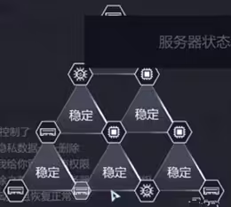

# 第三章 消失的证据

1. 接听Ashley的电话后，打开邮箱收集信息
【Austin Hill】 【博尔顿中学】

2. 用浏览器搜索【Austin Hill】，点击Toothbook，收集：
* （1）AustinAus
* （2）TB2239204
* （3）担任学生会长一年
* （4）Jim Jones
* （5）向会长举报

3. 再用浏览器搜索【博尔顿中学】，收集：
* （1）Home：Austin有望连任
* （2）home：Jim参加了学生会会长的竞选
* （3）Our Story：Mackie Cousy
* （4）Activities：AI绘画机器人、火山爆发还原模拟
* （5）BBS的第四个贴的图片
* （6）BBS的第五个贴的图片、校长视而不见
* （7）倒数第一个贴：2003.08.14

4. 打开数据库，输入Austin相关信息并破解密码【hill1103】

5. 登录Austin的Hitalk，收集：
* （1）与Isabelle聊天：希望做我的女朋友、今晚约会很开心
* （2）与George聊天：去你爸那那一桶汽油、上次也不摆平了、我只不过给他点教训
* （3）与Tennyson聊天：她喜欢的是Jim、她还去了Jim小组

6. 登录Austin的邮箱，收集：
* （1）收件箱第一封：下午拿题目看一下
* （2）收件箱第二封：221-3282-4301、向学校捐款

7. 用浏览器搜索【Mackie Cousy】，点击Toothbook，收集：
* （1）Mackie_C
* （2）TB3984820

8. 打开数据库，输入Mackie相关信息并破解密码【cousy969】

9. 登录Mackie的邮箱，收集：
* （1）收件箱第一封：最近可能发生火灾、George Rogers
* （2）收件箱第二封：Isabelle Auteuil、图片

## 第一次推理

10. 第一次推理：
* （1）校长【包庇】Austin，Isabelle【讨厌】Austin，Austin【欺负】Jim，Austin【使唤】George
* （2）【欺负】—【科学小组】—【反对霸凌】—【表白遭拒绝】—【掀翻便当】—【科学作品】—【恶整Jim】—【准备汽油】—【注意火灾】

11. 打电话给Mackie套话【火灾】—【利诱】，收集：
* （1）科技展发生火灾
* （2）人为纵火痕迹
* （3）Jim是唯一留校学生
* （4）没看到谁放的火
* （5）204-6636-808

12. 用浏览器搜索【Jim Jones】，点击Toothbook，收集：
* （1）Jimmmmy
* （2）TB5949448
* （3）反对校园霸凌
* （4）不配和Austin竞争
* （5）匿名支持

13. 打开数据库，输入Jim相关信息并破解密码【JJ040911】

14. 登录Jim的Hitalk，收集：
* （1）与Isabelle聊天：警察问讯，统一口径（记一下聊天内容）
* （2）与Elvis聊天：8点多经过学校
* （3）与Dad聊天：科学杂志期刊

15. 用浏览器搜索【Isabelle Auteuil】，点击Toothbook，收集：（内容暂不可见）
* （1）IsabelleAAA
* （2）TB4269744

16. 用浏览器搜索【George Rogers】，点击Toothbook，收集：
* （1）GEORGEORGEOR
* （2）TB8521446

17. 入侵Jim的手机，选择第二个图片，入侵后，信息第二个内容得知WiFi密码为他的生日【20040911】，浏览器第二个【火烧多久人会死】收集，相册最后一个为日历密码提示【21349】，然后在设置这里连接WiFi，点击日历第四个【Isabelle生日】收集

18. 打开数据库，输入Isabelle相关信息并破解密码【AA750627】

19. 登录Isabelle的Hitalk，收集：
* （1）还有George
* （2）晚上没时间

20. 根据聊天内容推出George的地址【305】

21. 打开数据库，输入George相关信息并破解密码【gr627775】

22. 登录George的Hitalk，收集：
* （1）与Isabelle聊天：网址1、网址2
* （2）与Austin聊天：把他的眼睛戳瞎了

23. 打开【网址1】，收集：被大火烧伤

24. 打开【网址2】，收集：tmd居然打我

25. 用浏览器登录Isabelle的Toothbook，收集：
* （1）找我麻烦
* （2）拒绝追求，下场特很惨
* （3）Jim在挣扎中弄坏球门
* （4）《瞒天过海》

## 第二次推理

26. 第二次推理：
* （1）PM【8:00】
* （2）【Austin Hill】、【Jim Jones】、【Isabelle Auteuil】
* （3）【展厅布置】—【烧毁作品】—【发生火灾】—【展厅起火】—【消防车到达】—【车被发现】
* （4）【Austin在纵火中发生意外】

27. 打开右下窃听信息，收集：有可能看到Austin和我们在一起？

28. 打电话给Isabelle套话【Austin的车8点在学校】—【独眼看到你在学校】—【左臂】—【安抚】，收集：
* （1）阻止他放火
* （2）他还是死了
* （3）和Jim分工
* （4）尸体扔到学校后山

29. 提交信息

30. 提交到一半乱码，Van出现，三个问题随便回答，排列内存组图：

`成就：`

消失的证据：全线索通关第三章

多年前的录音：第三章，找到George保存的语音记录

抵挡骇客的攻击：第三章，提交信息后，在1分钟内阻止Van的入侵
