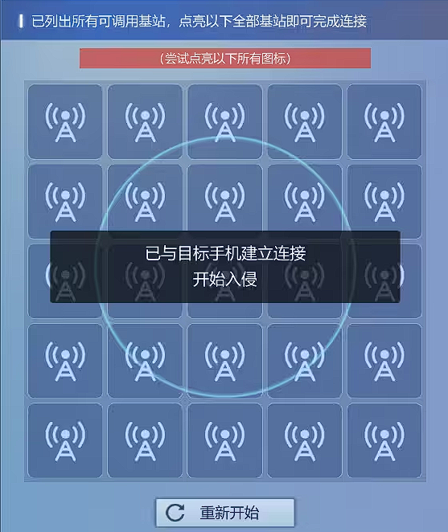
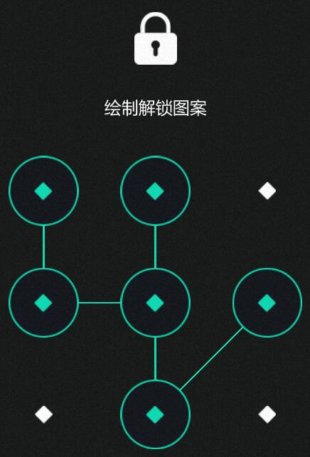
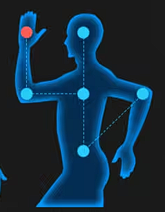

# DLC 甜蜜之家
1. 接听Herbert的电话后，打开邮箱收集信息

2. 打开数据库，输入Theresa相关信息，收集信息

3. 浏览器搜索【Theresa Meadows】，点击Theresa的Toothbook，收集
* （1）Or so.
* （2）TB8392858
* （3）男人果然还是更在意外貌
* （4）手表照片
* （5）Theresa的照片

4. 打开破解，输入Theresa相关信息并破解，得到密码【barb1154】

5. 登录Theresa的邮箱，收集【卡内余额：0欧元】

6. 登录Theresa的Hitalk，收集
* （1）Lynn：我是Lynn
* （2）Janke：斑点狗青年旅舍
* （3）姑妈：从此之后你死在外面也别来找我
* （4）Leandra：那些男生总叫我肥婆

7. 浏览器搜索【Lynn】（成就），点击Lynn的Toothbook，收集
* （1）Lynn
* （2）TB3217514

8. 浏览器搜索【斑点狗青年旅舍】，点击Readlt社区，收集【安慰Theresa的照片】

9. 返回，点击斑点狗青年旅舍，收集
* （1）预约电话020-2256-989
* （2）1408房间有血迹
* （5）两个失踪女孩是正常退房的

10. 打电话给斑点狗旅舍【表露身份】-【2022年2月6日】-【喝斥对方撒谎】（成就），收集
* （1）住宿记录4个月之前
* （2）出去时变短头发
* （3）拎着个大行李箱

11. 浏览器搜索【Herbert Lee】，点击Herbert的职业档案，收集【leeX@uu.com】

12. 返回，点击Herbert的Toothbook，收集
* （1）LeeX
* （2）TB3892857
* （3）注册了一个IMeet

13. 在浏览器IMeet网站输入【Herbert Lee】，收集【Hitalk：434869069】

14. 打开数据库，输入Herbert相关信息并破解密码【2377395X】

15. 登录Herbert的邮箱，收集
* （1）Carter Harris
* （2）296059067

16. 登录Herbert的Hitalk，收集
* （1）女儿：想买Lolita裙子
* （2）女儿：只知道攀比
* （3）Theresa：Claudia很喜欢你
* （4）Theresa：多准备些酒菜
* （5）Harris：205-9968-683

## 【家庭关系】调查
17. 调查【家庭关系】到100%后跟Herbert通话，结束后打开邮箱收集【妻子照片】

18. 打开照片，搜索相似图片，点击新闻网页，收集
* （1）Lisa Snyder
* （2）Anthony Beakland
* （3）大学毕业后与前夫合伙诈骗
* （4）出生日期：1988.11.18
* （5）社保号AG01219881118849
* （6）出生日期：1988.04.30
* （7）社保号AG01219880430242

19. 浏览器搜索【Lisa Snyder】，点击我认识的“蛇蝎妇女”，收集【Lisa父亲死的时候母亲出门采购】

20. 返回，点击“蛇蝎妇女”的母亲狱中看到新闻，收集【Lisa是个好孩子，保护妈妈】

21. 打开数据库，输入Lisa相关信息并破解密码【Lynn1907】

22. 登录Lisa（Theresa）的Hitalk，收集
* （1）☆☆☆：别再乱上网了
* （2）☆☆☆：怂恿爸爸买大钻戒
* （3）私家侦探：重要照片发送到手机
* （4）Nguyen：妇女读书会可以用邮箱报名
* （5）Nguyen：我的邮箱就是这样

23. 浏览器搜索【妇女读书会】，点击收集【@aluba.com】

24. 根据邮箱命名规则，推出邮箱【Theresa1994@aluba.com】

25. 登录Lisa（Theresa）邮箱，收集
* （1）我们很快就要见面了
* （2）来雨巷37号
* （3）乐享交易订单
* （4）Harris真实身份是Anthony Beakland

26. 浏览器搜索【Anthony Beakland】，点击“养成式恶棍”，收集
* （1）家里人宠爱有加
* （2）想要的东西一定要得到
* （3）过渡溺爱使Anthony慢慢成为了一个只懂索取的恶魔
* （4）肆意挥霍，喜欢赌博

27. 打开数据库，输入Anthony相关信息并破解密码【ABAB0242】

28. 登录Anthony的Hitalk，收集【有大活，加我】

## 【家庭中的秘密】调查

29. 调查【家庭中的秘密】到100%后跟Herbert通话，结束后选择【Chloe-bb】点亮基站（20秒内点亮成就）

30. 入侵Lisa的手机，打开相册收集【IMG2231照片】

31. 打开照片，收集有用信息【AG839480】
* 短信密码：145286 [提示： 浏览器里的经络图，红点是起点。]

32. 根据Lisa手浏览器收藏的网页得知短信密码，收集
* 日记密码：231 [提示：浏览器里《膳食配伍的原则》是221页，而短信里说喜欢后10页的文章，所以是 221 + 10]
* （1）Anthony：别伤害她，我去找你
* （2）Bruce Turner：新身份是找人做的假证

33. 根据Lisa手浏览器收藏的网页和短信得知日记密码，收集
* （1）93254267
* （2）我成为了她，与过去自己说再见
* （3）Claudia的现状像小时候的自己

34. 登录Lisa的另一个Hitalk账号【93254267】，收集
* （1）Janke：金色的麦田
* （2）Janke：P过的Theresa的照片（成就）
* （3）Emily：你很快就要倒霉了

35. 收集完6个线索后Herbert发来邮件，打开邮件收集女儿的信息

36. 浏览器搜索【Claudia J Lee】，点击Claudia的Toothbook，收集
* （1）Tears ☆
* （2）TB4577514
* （3）Emily Mayer
* （4）我一直叫Tears ☆
* （5）可能你是捡来的
* （6）不想被孤立，但没钱出去玩
* （7）我感觉自己从来没有被好好尊重过

37. 浏览器搜索【Tears ☆】，点击Tears ☆分享的照片，收集
* （1）小号Hitalk：756845275
* （2）自拍照（成就）

38. 打开数据库，输入Claudia相关信息并破解密码【20071227】

39. 登录Claudia的Hitalk，收集
* （1）Wesley：最近成绩不错
* （2）Emily：你可以先试试

40. 登录Claudia的Hitalk小号，收集（一个2个成就，有个成就不是收集要素）
* （1）Harris：能给我介绍吗
* （2）Harris：想让自己的继母消失
* （3）Harris：继母的照片
* （4）Harris：告诉了继母的手机号和邮箱
* （5）Harris：假装被绑架
* （6）Harris：继母的孩子被卖掉了（成就）
* （7）Emily：我很后悔
* （8）Emily：装成他喜欢的样子

41. 浏览器搜索【Emily Mayer】，点击Emily的Toothbook，收集
* （1）Emily AAA
* （2）TB5053469
* （3）16岁生日

42. 打开数据库，输入Emily相关信息并破解密码【Emily327】

43. 登录Emily的Hitalk，收集【以后每次都会给你抽成】

## 【妻女失踪背后的真相】推理

（1）Lee妻子的真实身份是？
* `【Lisa Snyder】`
* `【1988.11.18】`
* `【通缉犯】`
* `【第三张照片】`

（2）尝试推测Lisa是如何谋划，获得Theresa Meadows这个新身份的？
* `【在青年旅舍搭讪失恋的Theresa】`
* `【开导劝说Theresa使她心情变好】`
* `【教Theresa化妆，让她变美】`
* `【杀死Theresa，并拿走财物】`
* `【把Theresa尸体装进行李箱带出旅馆】`

（3）请选出对应标签贴在几人之间的关系线上：
* `Lisa←【替代】→Theresa`
* `Lisa←【爱情】→Herbert`
* `Claudia←【严格】←Herbert←【欺骗】←Anthony`
* `Claudia←【利用】→Anthony`
* `Claudia→【厌恶】→Lisa←【恐吓】←Anthony`

（4）引发Lisa与Claudia失踪的始作俑者是？
* `【Claudia拜托了Anthony让Lisa消失，使得自己没能回家，Lisa也不知去向】`

（5）目前哪些人此时正在一起？
* `【Anthony】【Lisa】【Claudia】`

45. 推理完，点击提交信息，输入【BY9527】【Aogesi Will】后确认（一次性输入正确成就）

46. 追捕嫌疑人，损毁率100%算成功（3分钟内追捕成功成就）
