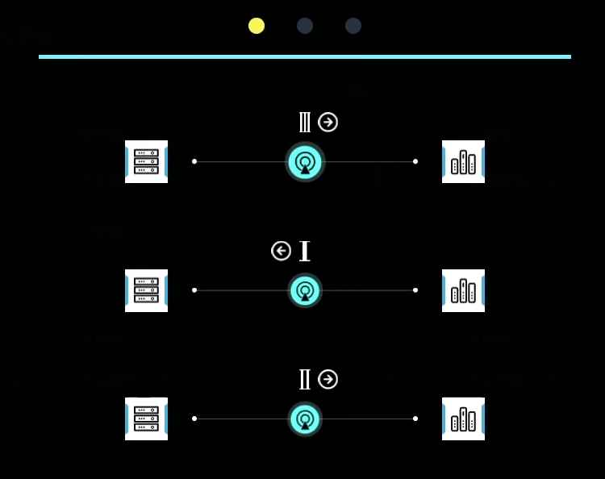
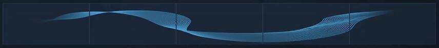
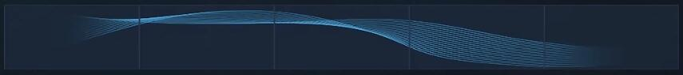
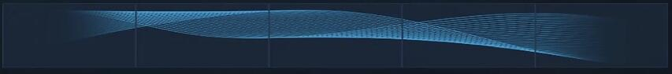
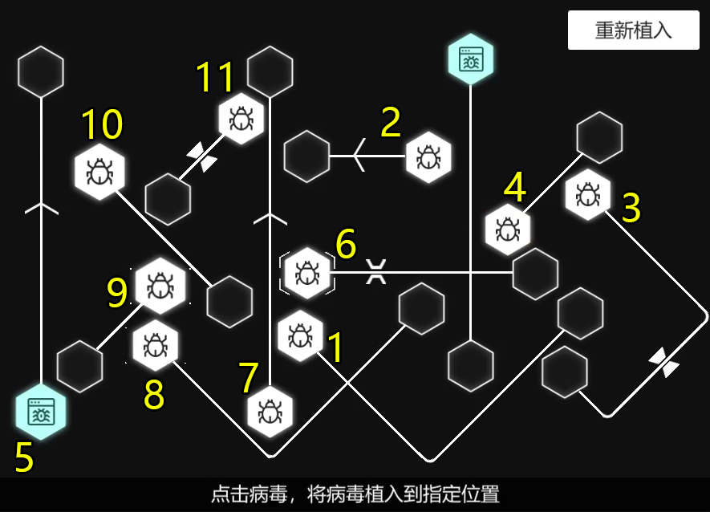

# DLC Hello,World

1. 接听？？？的电话，给【？？？】取名，并收到邮件（后续以？？？为主）

2. 跟Aogesi伪装套话，【语气温和】-【车祸昏迷】-【促进合作】

3. 入侵服务器，游玩类似塔防之类的破解，成功导出数据后，与？？？通话，获得：
* （1）Lucrezia Borgia
* （2）1978.07.16
* （3）泰坦公司

4. 浏览器搜索【Lucrezia Borgia】，点击Lucrezia的Toothbook，收集：
* （1）Lucy_77
* （2）TB3104579
* （3）吾爱永逝，人生也不再有意义

* `5浏览器网页【第三期全球未来智能科学会议将于高蒂时举行】里收集【Tom Blanco】`
* `6浏览器网页【泰坦高级研究员家人因暴风雪失踪】里收集【不幸遭遇暴风雪，现下落不明】`
* `7浏览器网页【泰坦高级研究员遇害】里收集：`
* （1）Benjamin Engel
* （2）博士车辆坠崖，随后车辆爆炸

8. 浏览器网页【走上绝路的少年杀手】里收集【被Lucrezia亲自招募的志愿者】

9. 打开数据库，输入Lucrezia相关信息并破解密码【621lucy7】

10. 登录Lucrezia的Hitalk，收集：
* （1）备忘录：结婚一周年2009.09.25
* （2）备忘录：lusim307
* （3）备忘录：Benjamin Engel生日1996.09.09
* （4）Kevin：前任姓名Kevin Hook
* （5）Kevin：前任电话061-9855-613
* （6）Kevin：当初你能对我好点，我也不会毫不留恋
* （7）Kevin：每个周末都和警卫从中午喝到晚上
* （8）Vincent：谈起了你的习惯，常去的地方，出差的行程等等
* （9）Vincent：它将为Benjamin付出一切
* （10）Vincent：实验室将要爆炸
* （11）Tom：我绝对不会把我的研究对象和实验样本数据共享给你
* （12）Tom：他不可能活过30岁
* （13）Tom：你会付出代价的，这次是生命的代价
* （14）A：在他去世一周前，一直找私家侦探调查我
* （15）A：没找到尸体，他们会不会还活着
* （16）A：帮帮我，看在一起长大份上
* （17）Ben：一只黑猫图片
* （18）.：如果你不希望她受到伤害的话
* （19）Simon：我可以辞职做一名家庭主妇
* （20）Simon：我提交了辞职报告，上面同意了
* （21）Simon：今天幼儿园发了三张雪山门票
* （22）Simon：我临时借到了会议通知

11. 登录Lucrezia的邮箱，收集：
* （1）收件箱Cloud：不要走盘山公路，从野路下山
* （2）收件箱Ashley：你的实验品作品定为待销毁AI作品
* （3）收件箱博登私家侦探社：咨询过将孩子转学到海外
* （4）收件箱博登私家侦探社：认为是他当时有与你离婚的打算
* （5）收件箱博登私家侦探社：多数员工已换，档案遗失，无从查证

12. 给Kevin匿名电话，【警卫】-【刺激：关于家暴】，收集：
* （1）出差几次认识了那个小白脸
* （2）认识没几个月的小白脸闪婚

13. 浏览器搜索【Tom Blanco】，点击Tom的Toothbook，收集：
* （1）blanco0509
* （2）TB2323556
* （3）一直被Lucrezia悉心照顾的Benjamin
* （4）你和学生的故事可多了
* （5）48岁生日推断1972.06.30

14. 打开数据库，输入Tom相关信息并破解密码【blanco72】

15. 登录Tom的Hitalk，收集：
* （1）家庭互娱：数据计算能告诉你，哪个女孩被你的性格掌控
* （2）Sandra：如果你觉得为难，我可以带别的女人
* （3）Daniel：多谢她的丈夫和她的助手的帮忙
* （4）Edwin：你两都是我学生，我不怎么喜欢Lucrezia
* （5）Vincent：为我之后的研究铺平道路

16. 登录Tom的邮箱，收集：
* （1）已发送行政部：我还是建议把她的丈夫还给他
* （2）已发送行政部：违规使用实验器材，伤害实验志愿者

## 【调查Lucrezia死前联系人】推理：

（1）Lucrezia Borgia博士的死因是什么？
* `【C3盘山公路车祸坠崖而亡】`

（2）Lucrezia连夜带Benjamin驾车离开实验室，是因为收到谁的消息？
* `【Vincent：那里马上要爆炸了】`

（3）Tom Blanco社交记录中的哪些信息与Lucrezia的死亡有关？
* `【在Hitalk上声称要让Lucrezia付出生命的代价】`
* `【在Toothbook中声称是Benjamin谋杀了Lucrezia】`
* `【从Hitalk中得知Vincent和Simon为Lucrezia的死亡推波助澜】`

 （4）Lucrezia在死前怀疑丈夫Simon并没有真的死亡，是因为？
* `【Simon的尸体并没有被找到】`
* `【费洛丁雪山的工作人员几乎全部更换且员工档案遗失】`

（5）Simon在消失之前的异常举动
* `【找私家侦探调查Lucrezia】`
* `【打听Lucrezia的出差行程】`
* `【打算与Lucrezia离婚】`
* `【为儿子咨询跨国寄读】`

18. 推理完获得【Simon Cavendish】姓名

19. 浏览器搜索【Simon Cavendish】，点击Simon的Toothbook，收集：
* （1）Simon_33
* （2）TB5432532
* （3）全家福照片
* （4）我改成新妻的TB昵称，推出邮箱Lucy_77@uu.com
* （5）让人有种“一切都是命中注定”的感觉

19. 打开【全家福】照片，搜索相似图片，点击Toothbook，收集：
* （1）C_Shawn
* （2）TB5974332
* （3）Lana Cliff
* （4）自拍照（成就）

20. 浏览器搜索【Lana Clif】，点击Lana的Toothbook，收集【全家福】（成就）

21. 打开数据库，输入Simon相关信息并破解密码【1011simc】（门牌号跟Lucrezia一样）

22. 登录Simon的邮箱，收集：
* （1）J.N律师事务所：不建议你现阶段离婚
* （2）伦敦威斯特寄宿学校：无法按照你的要求一周内办理好手续
* （3）Vincent：Vincent Valen Park
* （4）Vincent：557359648
* （5）垃圾箱未知：Cloud Shawn
* （6）垃圾箱未知：1984.03.05

23. 登录Simon的Hitalk，收集：
* （1）Lily：我俩恋爱前，行程完全重合
* （2）Lily：你们也想把曾是孤儿无牵无挂的Lucrezia完全掌控在手里
* （3）Lily：我只是泰坦用来牵制她的棋子
* （4）Lily：她能为全人类做贡献，我们不能失去她

24. 打开数据库，输入Cloud相关信息并破解密码【miss77SC】

25. 登录Cloud的Hitalk，收集：
* （1）Lana：为什么要买这些东西（成就）
* （2）丁二酮肟：注意敏感词汇，别被捕捉到（成就）
* （3）丁二酮肟：感谢博士，她帮了我们
* （4）Maria：毕竟他从小就挺过了那场劫难

26. 浏览器搜索【Vincent Valen Park】，点击Vincent的Toothbook，收集：
* （1）Vincent Runner
* （2）TB5521669
* （3）qau3d8eh@uu.com

27. 打开数据库，输入Vincent相关信息并破解密码【V5891inV】

28. 登录Vincent的邮箱，收集：
* （1）人事Lily：我不会接受被安排的人生
* （2）Edwin Hobb：Tom博士领导的实验组正在进行对Ai情感和道德的极限测试

29. 使用邮箱里的【213.12.111.32】地址转换Vincent的常用密码
【FCD1513AAB34E826500C47DDF9692228】

30. 用转换的密码登录Vincent的Hitalk，收集：
* （1）Shirley：体验报告
* （2）Shirley：为了制造出假的丈夫与孩子
* （3）Shirley：Simon和Billy根本没有死
* （4）Shirley：吃的并不是安眠药
* （5）Shirley：寿命缩短，最多剩下两年时间
* （6）Shirley：实验相关的研究材料原件不见了
* （7）Hannah：一个网址
* （8）Hannah：泰坦大瓜
* （9）Hannah：陪我看病的姑娘，我很喜欢

## 【Lucrezia的家庭关系】推理：

（1）Lucrezia是如何与Simon相爱的？
* `【初次出差途中偶遇】`
* `【二人正式相识】`
* `【Lucrezia与Kevin分手】`
* `【二人相信“命中注定”】`
* `【结婚】`

（2）Simon“死亡”之前Lucrezia曾做过什么重要决定？
* `【想辞职做全职主妇，上报泰坦后得到了批准】`

（3）以下对Simon描述错误的是？
* `【故意接近Lucrezia，并与之结婚】`
* `【Simon以另一个新身份活着都是为了得到更多的钱】`
* `【Simon与儿子其实已经在费洛丁雪山事故中丧生】`

（4）在泰坦体系中，与Simon作用相同的人还有谁？
* `【Vincent】`
* `【Sandra】`
* `【Shirley】`
* `【Lily】`

32. 推理完，连入侵Titan服务器

33. 入侵文档2

34. 入侵文档3

35. 入侵文档4

* Titan 07 （Dagger）

* 公关部负责人Titan 12 ＆ Titan 11 （Marionette ＆ Crybody）

* Titan 2 ＆ Titan 09 ＆ Titan 10 （Ravel ＆ Cylo ＆ Ashley）

36. 重启系统

37. 点击/home/文档5后退出系统，提交信息

